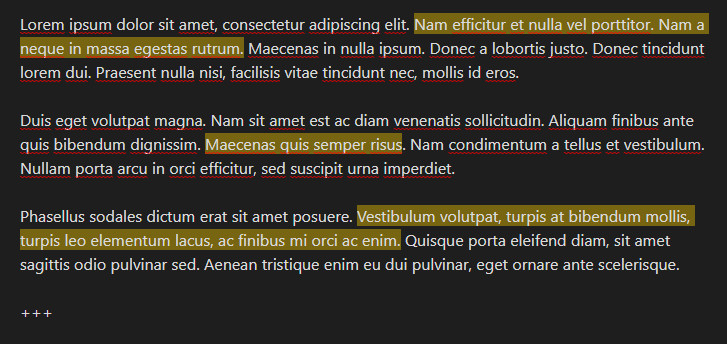

# 高级 Cloze：Anki、代码块与 LaTeX

> 提示：当前仓库可复用的截图多来自较早的英文界面，但布局和入口位置仍可作为对照。

## 这是什么
- 这一页专门处理高级写法：Anki 风格 Cloze、代码块 Cloze、LaTeX Cloze、多行答案以及性能模式。
- 这些能力很有用，但不建议在你还没跑通基础写法时就先上。

## 从哪里进入
- 支持者相关的 Anki Cloze、代码块 Cloze、LaTeX Cloze 设置。
- 与上下文行数、性能模式和软限制相关的设置。
- 复杂 Cloze 的实际内容来源。

## 适合什么场景
- 你在迁移既有的 Anki 风格文本。
- 你在学编程或数学，需要在代码和公式里挖空。
- 你发现普通 Cloze 一到复杂上下文就开始变慢或显示混乱。

## 具体步骤
1. 先确认你的目标场景是不是“基础 Cloze 无法覆盖”，而不是“我想一次把所有高级能力都开上”。
2. 逐项开启支持者能力并做小样本测试，尤其是代码块和 LaTeX 这种更依赖上下文的场景。
3. 如果页面变慢、内容过长或上下文失控，再回到设置页降低上下文范围、启用更保守的性能模式，或缩小软限制。
4. 遇到迁移场景时，先用少量历史笔记验证，再批量启用 Anki 风格语法。

## 相关设置 / 相关命令
- 相关设置：Anki Cloze、代码块 Cloze、LaTeX Cloze、代码上下文行数、上下文性能模式、软限制行数。
- 参考截图： `cloze-with-blank-lines-front1.jpg`、`cloze-with-blank-lines-answer.jpg`。

## 常见错误
- 基础卡片还没稳定，就先开启所有高级能力。
- 在没有支持者能力或依赖条件的情况下，期待高级 Cloze 直接生效。
- 遇到显示慢或上下文过长时，只怪算法，不去检查上下文和性能相关设置。

## FAQ
- **高级 Cloze 是不是默认就应该开**：不是。只有你的内容类型真的需要时，再按场景逐项启用。
- **为什么代码块 Cloze 看起来和普通文本不一样**：因为它会额外受代码上下文、渲染和性能策略影响。
- **LaTeX Cloze 需要特别注意什么**：需要确认你的公式内容、渲染方式和当前支持者能力都已经准备好。

## 排错与风险提示
- 高级 Cloze 最容易把性能、显示和迁移问题混在一起，所以一定要小步验证。
- 当你依赖支持者能力时，文档和界面里的开关可见不等于实际已经对当前环境完全可用。

---

继续阅读：
- [卡片与笔记设置](../settings/flashcards-and-notes.md)
- [设置与解析问题](../troubleshooting/settings-and-parse-issues.md)
- [卡片编写总览](./index.md)
