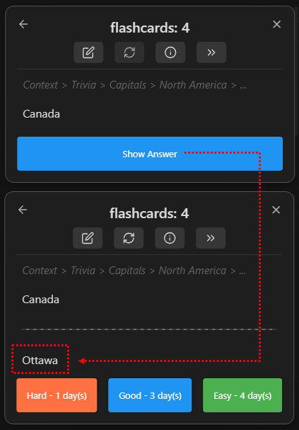

# 问答卡：最稳定的入门写法

> 提示：当前仓库可复用的截图多来自较早的英文界面，但布局和入口位置仍可作为对照。

## 这是什么
- 问答卡是最直接的卡片写法：问题和答案通过分隔符拆开。它通常也是最容易维护、最适合新用户的格式。
- 如果你想先建立一套不容易出错的笔记写法，从这页开始最稳。

## 从哪里进入
- 普通文本中的单行分隔符。
- 多行答案、空行答案或表格前空行等写法。
- 与分隔符相关的设置。

## 适合什么场景
- 你需要把定义、术语、公式结论写成清晰的问答对。
- 你正在摸索最不容易出问题的写法。
- 你希望别人也能看懂你的笔记结构。

## 具体步骤
1. 先确认你当前项目使用的单行分隔符和多行分隔符是什么。
2. 从一张最简单的问答卡开始，验证它能否稳定进入牌组树。
3. 如果你要写多行答案、表格或带空行的内容，逐步测试每种写法，不要一口气把整篇文章都改掉。
4. 只要某种写法不稳定，就先退回最简单的问答格式，确认问题是不是由复杂排版带来的。

## 相关设置 / 相关命令
- 相关设置：单行分隔符、多行分隔符。
- 参考截图： `table-with-no-preceding-blank-line.jpg`、`table-with-preceding-blank-line.jpg`、`table-with-preceding-blank-line+++.jpg`。

## 常见错误
- 没有确认当前分隔符设置，就按别人的教程生搬硬套。
- 在表格或多行答案前少了关键空行，导致识别失败。
- 一次性改很多写法，结果不知道是哪一个细节导致没出卡。

## FAQ
- **为什么我写了问答却没出卡**：通常是分隔符、空行、同步时机或当前文件类型出了问题。
- **问答卡和 Cloze 哪个更好**：问答卡更直白、更稳定；Cloze 更灵活，但也更容易被上下文和显示方式影响。
- **表格内容能稳定做卡吗**：可以，但你要特别注意空行和多行格式的边界。

## 排错与风险提示
- 当你复制粘贴复杂排版内容时，最容易引入隐藏的空行和分隔符问题。
- 如果你依赖表格、代码或数学公式，建议尽快阅读高级写法页面，避免把所有问题都归咎于普通问答卡。

---

继续阅读：
- [Cloze 工作流](./cloze-workflow.md)
- [高级 Cloze](./advanced-cloze.md)
- [卡片编写总览](./index.md)
