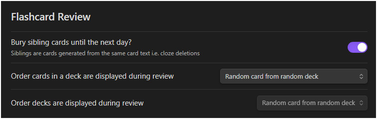

# 牌组选项、每日限制与同步

> 提示：当前仓库可复用的截图多来自较早的英文界面，但布局和入口位置仍可作为对照。

## 这是什么
- 这页负责解释你如何控制闪卡工作流的节奏：学习步长、每日新卡上限、每日复习上限、自动前进、进度条，以及和同步相关的维护动作。
- 它比算法页更贴近日常使用，因为它会直接改变你一天里看到多少内容。

## 从哪里进入
- 牌组树中的齿轮按钮。
- 与同步、重建缓存、清理 ghost cards 相关的命令入口。
- 某些笔记视图中的延期或维护按钮。

## 适合什么场景
- 你觉得今天刷得太多，想压低新卡或复习上限。
- 你想给不同牌组分配不同节奏。
- 你刚做了大量文本修改，需要重新同步或重建缓存。

## 具体步骤
1. 从牌组树里选择一个你最常用的牌组，打开齿轮进入牌组选项。
2. 先调整每日新卡和每日复习上限，因为这两个参数最容易直接改变体感。
3. 只有在你理解复习节奏后，再去碰学习步长、自动前进或显示相关设置。
4. 如果数量看起来不对，优先执行同步或必要的缓存重建，而不是先怀疑牌组选项。
5. 如果你怀疑存在 ghost cards 或历史残留，再使用更偏维护性质的命令。

## 相关设置 / 相关命令
- 相关页面： [算法与 WMS](../settings/algorithms-and-wms.md)、[同步、缓存与 Overlay](../data-and-sync/sync-cache-and-overlay.md)。
- 相关截图： `flashcard-settings-scheduling-data.jpg`、`flashcard-settings-separators.jpg`、`flashcard-settings-tag-folders.jpg`。

## 常见错误
- 把每日上限和算法参数混为一谈。前者控制今天看多少，后者控制下一次什么时候出现。
- 数量一异常就立即清理数据，而不是先做同步或缓存重建。
- 给每个牌组都设复杂预设，最后自己也记不住哪个牌组用了什么。

## FAQ
- **每天应该设置多少新卡**：没有统一答案。先从你能稳定坚持的量开始，再观察一到两周。
- **什么时候该重建缓存**：通常是大范围改写、迁移、排查明显不同步问题时，而不是日常每次都做。
- **ghost cards 一定要清理吗**：只有当你已经确认出现历史残留或异常状态时，才需要把这类维护动作提上日程。

## 排错与风险提示
- 维护命令会直接改变你对当前状态的观测结果，所以执行前先确认自己是在“排障”而不是“日常复习”。
- 如果你准备做大规模数据处理，先看 [数据与同步总览](../data-and-sync/index.md) 和 [旧存储迁移](../data-and-sync/legacy-storage-migration.md)。

---

继续阅读：
- [算法与 WMS](../settings/algorithms-and-wms.md)
- [同步、缓存与 Overlay](../data-and-sync/sync-cache-and-overlay.md)
- [闪卡复习总览](./index.md)
