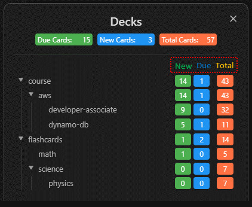

# 闪卡复习总览

> 提示：当前仓库可复用的截图多来自较早的英文界面，但布局和入口位置仍可作为对照。

## 这是什么
- 这一组页面围绕 Syro 的闪卡工作流：如何进入牌组树、如何开始一次复习、如何理解四个评分按钮，以及如何管理牌组选项和每日限制。
- 如果你主要在意 Again / Hard / Good / Easy、牌组树和卡片写法，这一组就是主线。

## 从哪里进入
- 命令 `Review flashcards from all notes`、`Select a deck to cram`、`Review flashcards in this note`、`Cram flashcards in this note`。
- 状态栏和 Ribbon 的闪卡入口。
- 进入后，你会看到牌组树、同步按钮和具体的复习会话。

## 适合什么场景
- 你已经有了一批卡片，想用牌组树统一开始复习。
- 你想只复习当前笔记中的卡片，而不是整个库。
- 你希望通过牌组选项控制每日新卡和复习上限。

## 具体步骤
1. 先阅读 [牌组树与复习入口](./deck-tree-and-entry.md)，理解 New / Learn / Due 和不同进入方式的区别。
2. 再进入 [复习会话](./review-session.md)，把“显示答案、评分按钮、快捷键、更多菜单”这套动作跑顺。
3. 如果你要自己写卡片，继续去 [卡片编写总览](../card-authoring/index.md)。
4. 当你需要控制每日节奏时，再读 [牌组选项与同步](./deck-options-and-sync.md)。

## 相关设置 / 相关命令
- 相关页面： [牌组树与复习入口](./deck-tree-and-entry.md)、[复习会话](./review-session.md)、[牌组选项与同步](./deck-options-and-sync.md)。
- 与内容来源相关的说明见 [卡片编写总览](../card-authoring/index.md)。

## 常见错误
- 把“牌组树入口”和“具体卡片会话”混为一页看，导致很多按钮看不懂。
- 只会用整库复习，不知道其实可以单笔记复习或集中复习。
- 没有理解牌组选项和每日上限，就直接调很多算法参数。

## FAQ
- **闪卡复习一定要先写 Q/A 卡吗**：不一定。你也可以用 Cloze、高亮、粗体、代码块或 LaTeX 作为来源。
- **牌组树是不是只适合大量卡片**：不是。即使卡片不多，牌组树仍然是理解 New/Learn/Due 和进入范围的最好入口。
- **闪卡复习和笔记复习谁更重要**：取决于你的学习风格。很多用户会把整篇笔记推进和闪卡巩固结合起来。

## 排错与风险提示
- 如果你在复习前刚做过大量笔记修改，建议先让同步完成，否则牌组数量和卡片状态可能落后于实际文本。
- 如果你准备手工调整每日限制或预设，先确认你理解这些设置影响的是“进入范围”和“节奏”，不是直接改写原文。

---

继续阅读：
- [牌组树与复习入口](./deck-tree-and-entry.md)
- [复习会话](./review-session.md)
- [卡片编写总览](../card-authoring/index.md)
