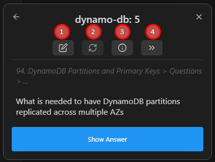

# 复习会话：显示答案、评分与快捷键

> 提示：当前仓库可复用的截图多来自较早的英文界面，但布局和入口位置仍可作为对照。

## 这是什么
- 这页描述你真正面对一张卡片时会发生什么：先看题面、再显示答案、再打分，必要时还可以撤销、打开原笔记、延期或删除。
- 如果牌组树是总控台，这一页就是你每天停留时间最长的地方。

## 从哪里进入
- 从牌组树点击某个牌组。
- 从“复习当前笔记中的卡片”进入单笔记模式。
- 从集中复习入口进入只看当前待处理集合的会话。

## 适合什么场景
- 你想理解 Again / Hard / Good / Easy 到底是什么节奏差异。
- 你想用键盘而不是鼠标完成大部分评分。
- 你想在复习时随时跳回原文检查上下文。

## 具体步骤
1. 进入一组真实卡片，先只看题面，确认你能理解它的来源和上下文。
2. 使用“显示答案”动作，再根据掌握程度选择 Again / Hard / Good / Easy。
3. 当你需要回看原笔记时，用打开原文相关入口，而不是离开会话后自己去搜索文件。
4. 熟悉快捷键后，尽量用键盘完成常见动作，复习会明显顺畅很多。
5. 如果你发现某张卡不适合现在处理，再考虑延期、撤销或删除，而不是胡乱评分。

## 相关设置 / 相关命令
- 常见快捷键包括空格、数字键评分、撤销以及与原文相关的操作。
- 相关页面： [牌组选项与同步](./deck-options-and-sync.md)、[卡片编写总览](../card-authoring/index.md)。

## 常见错误
- 在没显示答案前就凭感觉评分，导致节奏混乱。
- 把 Again / Hard / Good / Easy 当成绝对分数，而不是下一次出现时机的判断。
- 会话里遇到问题时立刻删卡，而不是先检查卡片写法或上下文设置。

## FAQ
- **Again / Hard / Good / Easy 需要背公式吗**：不需要。先理解它们分别代表“非常不熟 / 勉强回忆 / 正常掌握 / 明显轻松”就够用了。
- **我能在会话里回到原文吗**：可以，这是理解上下文和修正文案的重要方式。
- **删除卡片会不会影响原文**：删除的是插件视角下的卡片实体，你仍然需要自己判断是否也要调整原文写法。

## 排错与风险提示
- 如果你连续遇到很多看不懂的卡，优先回到 [卡片编写](../card-authoring/index.md) 或相关设置页校准写法，而不是继续硬刷。
- 如果你依赖自动前进、进度条或支持者能力，先确认当前设置和版本确实已启用对应行为。

---

继续阅读：
- [牌组选项与同步](./deck-options-and-sync.md)
- [卡片编写总览](../card-authoring/index.md)
- [闪卡复习总览](./index.md)
