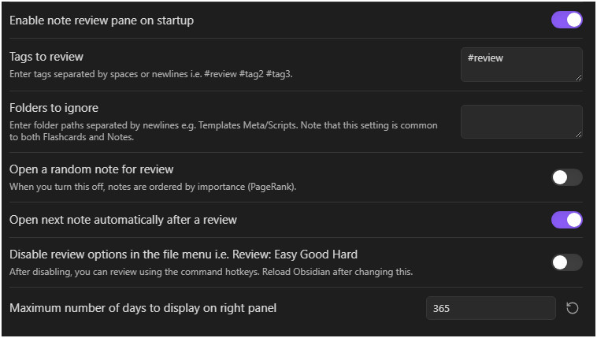

# 首次配置与核心概念

> 提示：当前仓库可复用的截图多来自较早的英文界面，但布局和入口位置仍可作为对照。

## 这是什么
- 这一页解释第一次使用 Syro 时最容易混淆的几个概念：追踪笔记、牌组、卡片、队列、Timeline、同步、缓存。
- 你不需要一开始就理解全部算法细节，但必须知道这些概念分别属于哪条工作流。

## 从哪里进入
- 第一次配置通常从设置页和命令面板开始。
- 真正进入日常使用后，你会在笔记复习队列和闪卡牌组树之间来回切换。

## 适合什么场景
- 你已经打开了插件，但不知道“先追踪笔记”还是“先做卡片”。
- 你听过 FSRS、WMS、Overlay，却还不知道它们在日常使用里意味着什么。
- 你希望先建立一条稳定流程，再逐步理解高级能力。

## 具体步骤
1. 先决定你的内容来源：整篇笔记是“笔记复习”的原材料；能被解析或生成的问题与答案则属于“闪卡复习”的原材料。
2. 把“追踪笔记”理解成把一篇笔记纳入笔记复习系统。它决定笔记会不会出现在右侧队列、能不能记录 Timeline 与优先级。
3. 把“牌组”理解成闪卡的组织方式。它主要影响你在牌组树里如何进入、如何分配每日上限和预设。
4. 把“同步和缓存”理解成 Syro 重新理解你的笔记内容、把新变化写进插件数据的过程。只要你刚改了很多文件，就要考虑它。
5. 在进入高级设置前，先跑通一个最小流程：打开命令面板 -> 追踪一篇笔记或进入闪卡牌组树 -> 完成一次真实评分 -> 再回来看设置。

## 相关设置 / 相关命令
- 后续阅读： [笔记复习总览](../note-review/index.md)、[闪卡复习总览](../flashcards/index.md)、[卡片编写总览](../card-authoring/index.md)。
- 第一次不建议直接深入： [算法与 WMS](../settings/algorithms-and-wms.md)、[实验与高级](../experimental/index.md)。

## 常见错误
- 以为“追踪笔记”会自动等于“生成卡片”，结果对两条工作流的边界没有预期。
- 刚开始就手工改数据文件，而没有先理解缓存、Overlay 和迁移页面。
- 看见 WMS 模拟器或 AI 设置就立刻调整，导致不知道哪个变化真的生效。

## FAQ
- **我必须同时使用笔记复习和闪卡复习吗**：不必须。它们可以同时使用，也可以先只选一条主线。
- **我需要一开始就学会所有设置吗**：不需要。先跑通一个真实场景，再回来查对应设置页，会更容易理解每个开关的意义。
- **同步、缓存和数据文件需要我天天手动操作吗**：通常不需要。只有在大批量修改、迁移或排错时，你才需要系统理解这些概念。

## 排错与风险提示
- 如果你不理解两条工作流的边界，就容易把“没出卡”和“没进队列”当成同一种问题。
- 如果你准备备份或迁移，请先阅读 [数据与同步总览](../data-and-sync/index.md)。

---

继续阅读：
- [笔记复习总览](../note-review/index.md)
- [闪卡复习总览](../flashcards/index.md)
- [卡片编写总览](../card-authoring/index.md)
