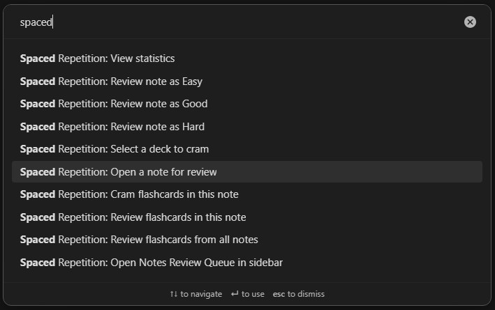

# 开始使用 Syro

> 提示：当前仓库可复用的截图多来自较早的英文界面，但布局和入口位置仍可作为对照。

## 这是什么
- 这一页负责把 Syro 的最小上手路径讲清楚：你从哪里打开插件、什么时候该走笔记复习、什么时候该走闪卡复习，以及第一次配置时先看哪些设置。
- 如果你只想快速找到入口，这一页够用；如果你要深入具体工作流，请继续进入子页。

## 从哪里进入
- 命令面板是最通用的入口，适合第一次找功能、验证插件是否正常加载。
- 状态栏适合日常复习时快速进入笔记复习或闪卡复习。
- Ribbon 和侧边栏适合重度使用者把 Syro 固定在工作区里。
- 文件和文件夹右键菜单适合在阅读过程中就地把笔记纳入复习。

## 适合什么场景
- 你刚启用插件，不知道第一步该点哪里。
- 你知道 Syro 是复习插件，但不理解“笔记复习”和“闪卡复习”为什么是两条工作流。
- 你希望先建立一条最稳的使用习惯，再逐步学习高级设置。

## 具体步骤
1. 打开命令面板并搜索 `Syro`，确认你能看到命令列表。只要命令能出现，说明插件已经完成基本注册。
2. 决定你的主工作流：如果你想按照整篇笔记推进，优先从 [笔记复习总览](../note-review/index.md) 进入；如果你想先看卡片和评分按钮，优先从 [闪卡复习总览](../flashcards/index.md) 进入。
3. 如果你还没有任何卡片或追踪笔记，先去 [首次配置与核心概念](./first-setup-and-core-concepts.md) 把“追踪笔记、牌组、卡片、队列”这些概念对齐。
4. 完成最小上手后，再阅读 [所有入口](./entry-points.md) 把命令面板、状态栏、右键菜单和侧边栏的定位分清。

## 相关设置 / 相关命令
- 相关页面： [所有入口](./entry-points.md)、[首次配置与核心概念](./first-setup-and-core-concepts.md)。
- 后续可继续： [笔记复习总览](../note-review/index.md)、[闪卡复习总览](../flashcards/index.md)。

## 常见错误
- 第一次就去调整大量算法参数，而没有先跑通一个最小复习流程。
- 明明想复习整篇笔记，却先把注意力放到牌组树和评分按钮上。
- 只看一个入口就认定“插件没有这个功能”，忽略了命令面板、右键和侧边栏之间的分工。

## FAQ
- **开始使用这一组页面应该先看哪一页**：先看这一页，再看“所有入口”，最后看“首次配置与核心概念”。这样能最快建立心智模型。
- **我能只使用笔记复习而不用卡片吗**：可以。Syro 的笔记复习和闪卡复习是相关但独立的两条工作流。
- **我能只使用闪卡而不追踪整篇笔记吗**：可以。你仍然可以通过牌组树和卡片入口完成独立的闪卡复习。

## 排错与风险提示
- 如果你直接从高级入口起步，容易把实验功能、兼容字段和稳定功能混在一起。
- 如果命令面板完全看不到 Syro 命令，先不要继续读文档，优先检查插件是否正确安装和启用。

---

继续阅读：
- [所有入口](./entry-points.md)
- [首次配置与核心概念](./first-setup-and-core-concepts.md)
- [中文文档总览](../index.md)
