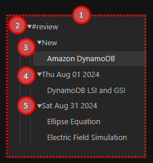

# 笔记复习总览

> 提示：当前仓库可复用的截图多来自较早的英文界面，但布局和入口位置仍可作为对照。

## 这是什么
- 这一组文档围绕 Syro 的笔记复习工作流：如何让笔记进入队列、如何在右侧侧边栏筛选、如何用优先级推动阅读顺序，以及如何通过 Timeline 保存上下文。
- 它适合把整篇笔记当成学习单位的人，而不是只看卡片评分的人。

## 从哪里进入
- 命令面板里的 `Open a note for review` 和 `Open Notes Review Queue in sidebar` 是最稳的入口。
- 状态栏、侧边栏自动打开以及文件右键菜单也都能把你带入笔记复习。
- 如果你已经在阅读具体笔记，右键和就地评分往往比手动切回命令面板更自然。

## 适合什么场景
- 你想按整篇笔记推进，而不是先拆成卡片。
- 你要从很多候选笔记里决定今天先读哪篇。
- 你希望记住上次读到哪里、看过哪些段落、留了什么进度。

## 具体步骤
1. 先学会 [追踪笔记与进入方式](./tracked-notes-and-entry.md)，否则很多队列行为都不会出现。
2. 再学会 [复习队列侧边栏](./review-queue-sidebar.md)，它决定你如何从大量笔记里挑出下一篇。
3. 当你开始用标签和优先级做精细管理时，继续看 [标签、优先级与筛选](./tags-priority-and-filtering.md)。
4. 如果你希望长期追踪阅读位置和历史提交，再进入 [Timeline](./timeline.md)。

## 相关设置 / 相关命令
- 相关设置集中在 [设置总览](../settings/index.md) 的 Notes 相关页面。
- 如果你实际更关心卡片评分和牌组配额，请直接进入 [闪卡复习总览](../flashcards/index.md)。

## 常见错误
- 没有先追踪笔记，就期待它自动出现在队列里。
- 只看到队列列表，却没有使用标签、优先级和 Timeline 这些真正提升效率的能力。
- 把“右侧队列中的一篇笔记”误认为“一组卡片”，导致错误地找评分按钮。

## FAQ
- **笔记复习适合什么人**：适合需要回到原文、按整篇笔记推进学习、并希望保留上下文的人。
- **我能在笔记复习里直接给出评分吗**：可以，但它是针对笔记工作流的评分和推进，不等同于闪卡工作流里的 Again/Hard/Good/Easy。
- **队列是不是按固定顺序排列**：不是。标签、优先级、到期分区以及相关设置都会影响你看到的顺序。

## 排错与风险提示
- 如果你频繁改标签、重命名文件或批量移动目录，先确认同步已经完成，否则队列可能暂时落后于你的实际文件状态。
- 如果你依赖 Timeline 回溯上下文，请避免在不理解数据结构的情况下手工删改相关文件。

---

继续阅读：
- [追踪笔记与进入方式](./tracked-notes-and-entry.md)
- [复习队列侧边栏](./review-queue-sidebar.md)
- [Timeline](./timeline.md)
