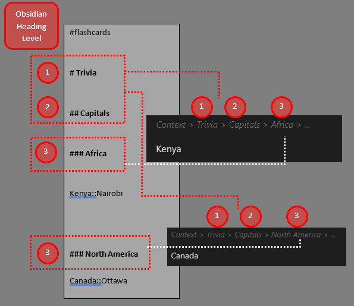

# Timeline：保存阅读位置与历史进度

> 提示：当前仓库可复用的截图多来自较早的英文界面，但布局和入口位置仍可作为对照。

> 待补截图：建议补一张 Timeline 抽屉展开图、一张提交记录图，以及一张点击旧记录后回到正文位置的图。

## 这是什么
- Timeline 是笔记复习工作流里最能体现“上下文连续性”的能力。它不仅记录你看过什么，还能尽量帮你回到上次停下的位置。
- 如果你经常阅读长文、课程笔记或项目记录，这一页值得认真看。

## 从哪里进入
- 从笔记复习侧边栏中选中一篇笔记后，底部或相关区域会出现 Timeline 抽屉。
- 与之联动的还有自动展开、滚动百分比记录和上下文定位。

## 适合什么场景
- 你希望明天继续昨天那篇长文，而不是从头开始找位置。
- 你想知道自己什么时候看过这篇笔记、当时留下了什么阅读状态。
- 你需要在几篇长期推进的笔记之间切换，而不想丢失上下文。

## 具体步骤
1. 在队列中打开一篇已追踪笔记，并实际滚动、阅读、留下一点真实进度。
2. 触发一次与笔记复习相关的提交或推进动作，让 Timeline 生成至少一条记录。
3. 回到侧边栏查看 Timeline 条目，确认你能分辨出时间顺序和上下文信息。
4. 点击较早的一条记录，验证是否能回到接近当时阅读的位置。
5. 如果你觉得 Timeline 太吵或不够显眼，再回到 Notes 相关设置调整显示策略。

## 相关设置 / 相关命令
- 相关设置：显示滚动百分比、自动展开 Timeline。
- 相关页面： [复习队列侧边栏](./review-queue-sidebar.md)、[数据文件参考](../appendix/data-files-reference.md)。

## 常见错误
- 把 Timeline 当成普通历史日志，而没有利用它的定位和上下文价值。
- 阅读后没有形成任何提交或推进动作，却期待 Timeline 自动出现丰富记录。
- 在不了解数据文件用途前手动删改 Timeline 相关数据，造成上下文丢失。

## FAQ
- **Timeline 会替代我自己的笔记批注吗**：不会。它更像阅读进度和上下文恢复工具，而不是正文批注系统。
- **为什么有时回到的位置不是 100% 精准**：因为它会结合当前内容结构、滚动百分比和上下文来恢复，原文大改后位置可能只能近似。
- **我不需要 Timeline，可以不看吗**：可以，但如果你长期阅读长文或多篇笔记并行推进，Timeline 会非常有价值。

## 排错与风险提示
- 当你大幅重写原文结构后，旧记录对应的上下文可能只能部分恢复。
- 如果你依赖 Timeline 做长期回溯，请把相关数据文件和主数据一起备份，而不是只备份单一文件。

---

继续阅读：
- [数据文件参考](../appendix/data-files-reference.md)
- [故障排查总览](../troubleshooting/index.md)
- [笔记复习总览](./index.md)
