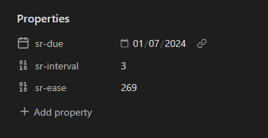

# 追踪笔记与进入方式

> 提示：当前仓库可复用的截图多来自较早的英文界面，但布局和入口位置仍可作为对照。

## 这是什么
- 这页专门讲“什么样的笔记会进入笔记复习系统”以及“你能从哪些地方把一篇笔记送进复习流程”。
- 在 Syro 里，追踪笔记不是抽象概念，而是决定右侧队列、牌组选择和历史上下文能不能工作的第一步。

## 从哪里进入
- 命令面板里的追踪 / 取消追踪命令。
- 文件右键菜单里的追踪、取消追踪、就地评分和设置重要性。
- 文件夹右键菜单里的批量追踪或取消追踪。
- 与标签或 frontmatter 相关的笔记组织方式。

## 适合什么场景
- 你有一篇正在读的长文，想让它以后还能回到队列里。
- 你想把一个文件夹里的学习笔记一次性纳入复习。
- 你想理解为什么某篇笔记明明存在却没有出现在队列里。

## 具体步骤
1. 先选中一篇 Markdown 笔记，确认它是你真正想纳入复习的内容。
2. 通过命令面板或文件右键菜单执行追踪动作；如果你处理的是一整个目录，则改用文件夹右键菜单。
3. 如果你的工作流依赖标签或 frontmatter，请在笔记元数据中保持一致命名，避免让同一批内容被不同规则反复识别。
4. 完成追踪后，打开笔记复习队列或直接 `Open a note for review`，确认该笔记已经进入可用状态。
5. 如果你需要更细的优先级排序，继续进入 [标签、优先级与筛选](./tags-priority-and-filtering.md)。

## 相关设置 / 相关命令
- 相关入口：文件右键、文件夹右键、命令面板。
- 相关页面： [复习队列侧边栏](./review-queue-sidebar.md)、[标签、优先级与筛选](./tags-priority-and-filtering.md)。

## 常见错误
- 在非 Markdown 文件上期待追踪命令生效。
- 只加了标签但没有理解当前项目的追踪规则，导致结果和预期不一致。
- 批量追踪整个文件夹后立刻开始判断队列结果，却没有留出同步时间。

## FAQ
- **追踪笔记会不会自动生成卡片**：不一定。追踪笔记属于笔记复习工作流；卡片解析属于另一条工作流。
- **取消追踪会不会删掉我的原文**：它主要影响插件管理的复习状态，而不是直接删除你的正文内容。
- **为什么文件夹右键看起来和单文件右键不一样**：因为它们解决的是不同粒度的问题：一个是就地处理单篇笔记，一个是批量处理目录。

## 排错与风险提示
- 如果你的目录结构经常大改动，建议先批量处理，再统一同步，避免队列短时间内出现“旧路径”印象。
- 如果你同时依赖标签规则和手动追踪，最好在团队或个人工作流里约定统一做法，减少判断成本。

---

继续阅读：
- [复习队列侧边栏](./review-queue-sidebar.md)
- [标签、优先级与筛选](./tags-priority-and-filtering.md)
- [笔记复习总览](./index.md)
