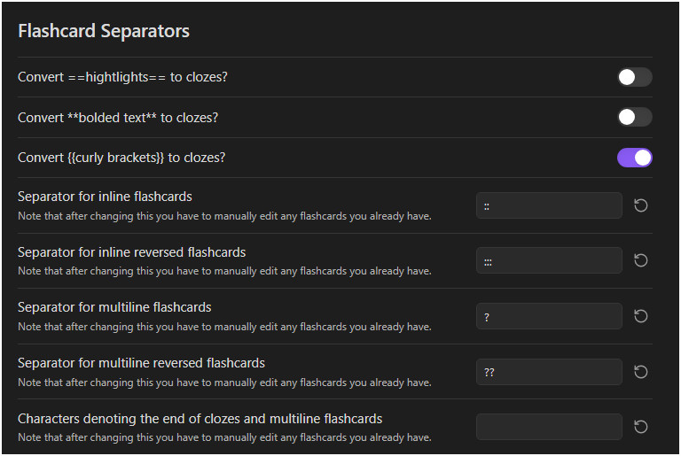

# 卡片与笔记设置

> 提示：当前仓库可复用的截图多来自较早的英文界面，但布局和入口位置仍可作为对照。

## 这是什么
- 这一页汇总最常用、最接近日常操作的设置：卡片顺序、问答分隔符、Cloze 来源、上下文模式、笔记复习侧边栏、忽略标签、Timeline 行为等。
- 如果你不是在专门做算法研究，这页通常是你最该先掌握的设置页。

## 从哪里进入
- Flashcards 标签下的卡片顺序、Cloze、分隔符和上下文相关设置。
- Notes 标签下的队列侧边栏、忽略标签、Timeline 相关设置。

## 适合什么场景
- 你想知道为什么没出卡、为什么上下文太长或太短。
- 你想控制卡片在会话中的顺序，或者让牌组更符合自己的复习节奏。
- 你想整理笔记复习队列，让标签、过滤条和 Timeline 更顺手。

## 具体步骤
1. 先确认卡片顺序设置，它决定你今天更常看到到期卡还是新卡，以及顺序 / 随机的差异。
2. 再确认问答分隔符与 Cloze 来源开关，这两组设置最容易影响“能不能出卡”。
3. 如果卡片能出但显示不理想，再调 Cloze 上下文模式、性能模式、软限制和“显示其他 Cloze”相关开关。
4. 回到 Notes 区域，按你的队列使用方式整理忽略标签、隐藏过滤条、显示滚动百分比和自动展开 Timeline 等设置。

## 相关设置 / 相关命令
- 相关页面： [问答卡](../card-authoring/qa-cards.md)、[Cloze 工作流](../card-authoring/cloze-workflow.md)、[复习队列侧边栏](../note-review/review-queue-sidebar.md)。
- 支持者能力相关的 Anki / 代码块 / LaTeX Cloze 边界见 [实验与高级](../experimental/index.md)。

## 常见错误
- 只改解析类设置，不去重新同步或重新测试样例笔记。
- 一口气把高亮、粗体、花括号、Anki Cloze 全部开上，导致后面很难判断是谁生效。
- 把队列体验问题都归咎于算法，而没有先整理忽略标签、优先级和过滤条。

## FAQ
- **为什么同样是 Cloze，有时看起来差很多**：因为来源、上下文模式、显示其他 Cloze 的开关和内容本身都会共同影响效果。
- **分隔符设置改完以后要做什么**：最好马上用一张最小样例笔记验证，并在需要时触发同步。
- **Notes 标签里的设置会影响闪卡吗**：大多数不会。它们更偏向右侧队列、Timeline 和笔记复习体验。

## 排错与风险提示
- 解析类设置和实际文本写法强绑定，改动前最好先准备一两份稳定样例做回归测试。
- 如果你准备解释给其他用户听，优先用“稳定可见设置”这套术语，不要直接抄代码中的旧字段名。

---

继续阅读：
- [算法与 WMS](./algorithms-and-wms.md)
- [界面与同步](./ui-and-sync.md)
- [设置与解析问题](../troubleshooting/settings-and-parse-issues.md)
