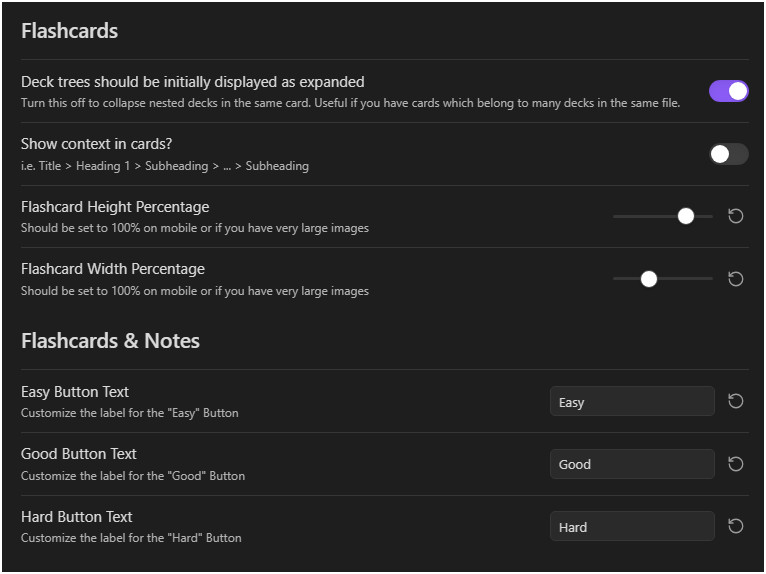

# 界面与同步

> 提示：当前仓库可复用的截图多来自较早的英文界面，但布局和入口位置仍可作为对照。

## 这是什么
- 这一页解释那些直接影响你每天“看起来如何”“同步提示怎么出现”“缓存是否保留”的设置。
- 它连接了视觉体验、状态栏、进度条、调试输出和自动增量同步等行为。

## 从哪里进入
- UI 标签页里的状态栏、动画、进度条和调试相关设置。
- Sync 标签页里的自动增量同步、缓存持久化、进度显示模式。

## 适合什么场景
- 你想让状态栏更显眼或更克制。
- 你希望同步提示不要频繁打扰自己，或者恰好相反，希望每次都能看到。
- 你在排障时需要临时开启更多调试信息。

## 具体步骤
1. 先决定状态栏是不是你的主入口。如果是，再去调颜色、动画和提醒方式。
2. 进度条和动画类设置先按舒适度微调，不要把它们当作调度设置。
3. 再决定自动增量同步和缓存持久化策略；绝大多数情况下保守稳定比频繁折腾更重要。
4. 调试输出只在排障期间短期开启，问题确认后尽量恢复默认，避免长期制造噪音。

## 相关设置 / 相关命令
- 相关页面： [数据与同步总览](../data-and-sync/index.md)、[设置与解析问题](../troubleshooting/settings-and-parse-issues.md)。
- 如果你对队列本身有疑问，回看 [复习队列侧边栏](../note-review/review-queue-sidebar.md)。

## 常见错误
- 把界面与同步设置当成算法设置来调。
- 为了排障长期保持高噪音调试输出，最后影响日常使用体验。
- 看见同步提示少了就误判为插件没工作，而不是先确认显示模式设置。

## FAQ
- **状态栏颜色和动画会影响调度吗**：不会。它们影响的是可见性和提醒体验。
- **自动增量同步一定要开吗**：多数用户建议开启；只有在特定排障或实验场景下才会考虑关闭。
- **缓存持久化有什么好处**：它能减少每次重启后的冷启动成本，但你仍然需要在大改动后理解同步流程。

## 排错与风险提示
- 如果你在排障时同时改了 UI 和 Sync 两组设置，最好做好记录，否则很难判断是显示问题还是状态问题。
- 缓存与同步设置直接影响你观察到的“当前状态”，改动前建议先读 [同步、缓存与 Overlay](../data-and-sync/sync-cache-and-overlay.md)。

---

继续阅读：
- [数据与同步总览](../data-and-sync/index.md)
- [同步、缓存与 Overlay](../data-and-sync/sync-cache-and-overlay.md)
- [设置总览](./index.md)
